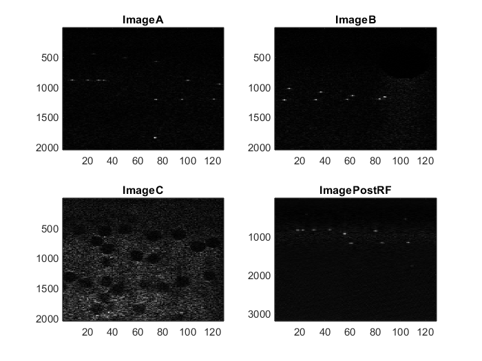

# Ultrasound Beamforming in MATLAB

A MATLAB course project for Ultrasound Physics that reconstructs ultrasound images from pre-beamformed radio-frequency (RF) channel data. It implements delay-and-sum beamforming with dynamic focusing and provides a second version with Hann (Hanning) apodization.

Both scripts process three input datasets and display their reconstructed images alongside an envelope image from a supplied post-beamformed phantom dataset.

## Requirements

- MATLAB with support for local functions in scripts and the `highpass` function.
- Signal Processing Toolbox for `highpass`, `hilbert`, and `hanning`.

The input `.mat` files are included in `data/`; no separate download is needed.

## Getting started

Open MATLAB, set the current folder to the repository root, and add the data directory to the search path:

```matlab
addpath(fullfile(pwd, 'data'));
```

Run the baseline implementation:

```matlab
main
```

Or run the version with apodization:

```matlab
main_apodization
```

Each script clears the workspace and command window, processes the datasets, and displays a four-panel grayscale figure. The reconstructed envelopes remain in the workspace as `imageA`, `imageB`, and `imageC`; the reference envelope is `ImagePostRF`. Figures are not automatically saved.

## How it works

For each scan line, the scripts:

1. Calculate a depth for each sample using the sampling frequency, sound velocity, and dead-zone offset.
2. Calculate a depth-dependent delay for each receive element from its distance to the focus point.
3. Round the delay to an integer number of samples and sum the aligned channel signals, skipping indices outside the recorded data.
4. In `main_apodization.m`, apply a Hann window across the receive channels before summation.
5. Apply a 4 MHz high-pass filter to the beamformed RF data and extract the envelope with `abs(hilbert(...))`.

The post-beamformed comparison dataset receives envelope extraction only. Each script also contains an unused `preBeamformImage` helper that sums channels without delay compensation, then filters and extracts the envelope.

## Repository contents

| Path | Purpose |
| --- | --- |
| `main.m` | Dynamic delay-and-sum beamforming with equal channel weights. |
| `main_apodization.m` | The same processing with Hann channel weights. |
| `data/PreRF_ImageA.mat` | First pre-beamformed input dataset. |
| `data/PreRF_ImageB.mat` | Second pre-beamformed input dataset. |
| `data/PreRF_ImageC.mat` | Third pre-beamformed input dataset. |
| `data/PostRF_Phantom.mat` | Post-beamformed phantom data used for comparison. |
| `images/` | Saved example figures for both implementations. |

The scripts expect each pre-beamformed file to contain a `preBeamformed` structure with `Signal`, `SampleFreq`, `Pitch`, `SoundVel`, `DeadZone`, and `Channels` fields. `Signal` is indexed as samples × receive channels × scan lines. The reference file must contain `PostRF.Signal`.

## Example results

### Without apodization



### With Hann apodization


## Implementation notes

This is an educational implementation with explicit nested loops. The scripts hard-code 2,048 samples per line and 128 scan lines; the receive-channel count comes from the input metadata. Adapting the code to other datasets requires reviewing these dimensions and the acquisition assumptions.

The delay calculation uses an empirically adjusted reference time of `2.05 * depth / c` and an element offset of `pitch * abs(channels / 2 - element)`. The source comments describe these as experimental adjustments for lateral resolution. They should be reviewed before reusing the algorithm with another acquisition geometry.

The figures display linear envelope amplitudes with sample and scan-line indices, without log compression or physical axis calibration. The repository does not include automated tests or a quantitative image-quality evaluation.
